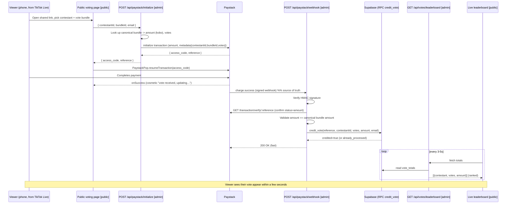

# TikTok-Live Paid Voting — Architecture & Build Spec

> **Purpose:** implementation spec for building a public, non-gated, pay-to-vote
> feature whose counts update live during a TikTok Live stream. Written to be fed
> directly into Claude Code CLI. Treat every section as a constraint, not a
> suggestion. When something is ambiguous, prefer the "Recommended" option noted
> inline and leave a `// TODO(human)` marker rather than guessing silently.

---

## 0. How to use this document

- This feature spans **two repositories**. Every file path below is prefixed with
  its repo: `[public]` = `wyteimagemedia` (Vite/React), `[admin]` =
  `admin.wyteimagemedia` (Next.js). Run Claude Code in whichever repo the current
  task touches.
- **Do not modify** the existing `[public] src/components/events/voting-page.tsx`
  or its route. It is a non-functional shell that stays as-is. All new public UI
  lives at **new routes**.
- **Reuse** existing contestants (Sanity `formSubmission` docs) and the existing
  admin app. Do not create a parallel contestant list.
- The **source of truth for a counted vote is the Paystack webhook**, never the
  browser. The browser callback is cosmetic only.

---

## 1. System context

| Concern | Technology | Where |
|---|---|---|
| Public voting UI + live leaderboard | Vite + React 18 + react-router 7 + Tailwind | `[public]` |
| Backend APIs (initialize, webhook, leaderboard) | Next.js 16 App Router (route handlers) | `[admin]` |
| Payments | Paystack (inline-js on client, REST + webhook on server) | both |
| Contestant data / CMS | Sanity (`formSubmission` docs, embedded Studio at `/studio`) | shared |
| Vote ledger + atomic counters | Supabase (Postgres + RPC) | `[admin]` |
| Email receipts/notifications (optional) | Resend | `[admin]` |
| Hosting | Vercel (both apps) | — |

Existing pieces to reuse (already built): admin Google auth (`[admin] lib/auth.ts`),
Sanity write client (`[admin] sanity/lib/writeClient.ts`), Paystack initialize
route (`[admin] app/api/paystack/initialize/route.ts` — needs extending), the
atomic-RPC pattern already used by the paywall (`check_and_increment_paywall` in
Supabase — mirror it), and recharts for admin charts.

---

## 2. Guiding decisions (locked)

1. **Non-gated.** No voter login, no account, no OTP. Payment is the only gate.
2. **Repeat voting allowed.** Each payment = a fresh, independent vote batch.
3. **Vote is credited by the webhook**, typically 2–5s after payment clears.
   Reliable even if the voter closes the tab.
4. **Counting must be atomic and idempotent.** Many people pay in the same second
   during a Live; no vote may be lost or double-counted, and Paystack webhook
   retries must be safe.
5. **Server is the source of price truth.** The client never dictates how many
   votes a payment buys. The server derives votes from a canonical bundle table
   and validates the paid amount.
6. **Contestant email on the transaction** (per client choice) with Paystack
   customer receipt emails **disabled** so candidates aren't flooded. A neutral
   `votes@…` address is the recommended alternative — leave a TODO.

---

## 3. End-to-end TikTok-Live flow



---

## 4. Data model

### 4.1 Supabase (source of truth for counts)

Create two tables and one RPC. Mirror the existing paywall RPC style (a single
Postgres function doing an atomic, idempotent write).

```sql
-- Ledger: one row per successful, verified payment. `reference` is unique.
create table if not exists votes (
  id           bigint generated always as identity primary key,
  reference    text        not null unique,          -- Paystack reference = idempotency key
  contestant_id text       not null,                 -- Sanity _id of the formSubmission
  votes        integer     not null check (votes > 0),
  amount_kobo  bigint      not null check (amount_kobo > 0),
  email        text,
  created_at   timestamptz not null default now()
);

create index if not exists votes_contestant_idx on votes (contestant_id);

-- Aggregate for fast leaderboard reads.
create table if not exists vote_totals (
  contestant_id text primary key,
  total_votes   bigint not null default 0,
  total_amount_kobo bigint not null default 0,
  updated_at    timestamptz not null default now()
);

-- Atomic + idempotent credit. Returns whether this call actually credited.
create or replace function credit_vote(
  p_reference text,
  p_contestant_id text,
  p_votes integer,
  p_amount_kobo bigint,
  p_email text
) returns table(credited boolean) language plpgsql as $$
begin
  -- Insert ledger row; if reference already seen, do nothing (idempotent).
  insert into votes(reference, contestant_id, votes, amount_kobo, email)
  values (p_reference, p_contestant_id, p_votes, p_amount_kobo, p_email)
  on conflict (reference) do nothing;

  if not found then
    return query select false;      -- duplicate webhook: already processed
    return;
  end if;

  -- Same transaction: bump the aggregate atomically.
  insert into vote_totals(contestant_id, total_votes, total_amount_kobo)
  values (p_contestant_id, p_votes, p_amount_kobo)
  on conflict (contestant_id) do update
    set total_votes = vote_totals.total_votes + excluded.total_votes,
        total_amount_kobo = vote_totals.total_amount_kobo + excluded.total_amount_kobo,
        updated_at = now();

  return query select true;
end;
$$;
```

Why this is safe: the `votes.reference` unique constraint + `on conflict do
nothing` makes the whole credit idempotent under concurrent duplicate webhooks;
the aggregate update runs in the same implicit transaction only when a new ledger
row was actually inserted.

### 4.2 Sanity (contestant data — reused, read-mostly)

Contestants are existing `formSubmission` docs (screened, not disqualified). No
schema change is strictly required because counts live in Supabase. **Optional**
(only if the admin dashboard should show live counts sourced from Sanity):
add numeric fields and write them back after each credit — but the simpler and
recommended path is to have the admin dashboard read Supabase via the leaderboard
API, leaving Sanity untouched.

> Note: existing `votesReceived` / `totalAmountFromVotes` on `formSubmission` are
> unstructured strings and are **not** used by this system. Do not rely on them.

---

## 5. API contracts (all `[admin]`, Next.js App Router route handlers)

### 5.1 `POST /api/paystack/initialize` — EXTEND existing

Existing handler forwards `{ email, amount }` to Paystack with no metadata. Change
it so the client sends a contestant + bundle, and the **server** computes the
amount and votes.

Define a canonical, server-only bundle table (single source of price truth):

```ts
// [admin] lib/voteBundles.ts
export const VOTE_BUNDLES = {
  b1:   { votes: 1,   amountKobo: 100 * 100 },
  b5:   { votes: 5,   amountKobo: 400 * 100 },
  b10:  { votes: 10,  amountKobo: 750 * 100 },
  b20:  { votes: 20,  amountKobo: 1400 * 100 },
  b50:  { votes: 50,  amountKobo: 3250 * 100 },
  b100: { votes: 100, amountKobo: 6000 * 100 },
} as const;
export type BundleId = keyof typeof VOTE_BUNDLES;
```

Request body:
```json
{ "contestantId": "<sanity _id>", "bundleId": "b10", "email": "contestant@example.com" }
```
Handler logic:
1. Validate `bundleId ∈ VOTE_BUNDLES` and `contestantId` is a real screened
   contestant (query Sanity). Reject otherwise (400).
2. Compute `amountKobo` and `votes` from the bundle (ignore any client amount).
3. Call Paystack `POST /transaction/initialize` with:
   ```json
   {
     "email": "<contestant or neutral email>",
     "amount": <amountKobo>,
     "metadata": { "contestantId": "...", "bundleId": "b10", "votes": 10 }
   }
   ```
4. Return `{ access_code, reference }` to the client. Keep existing CORS handling
   (allowed origins include the public site + localhost:5173).

### 5.2 `POST /api/paystack/webhook` — NEW

The heart of the system. Must be fast and idempotent.

```
Headers: x-paystack-signature: <hmac_sha512 of raw body using PAYSTACK_SECRET_KEY>
```
Steps:
1. Read the **raw** request body (needed for signature verification — do not use a
   pre-parsed body). Compute `HMAC-SHA512(rawBody, PAYSTACK_SECRET_KEY)` and
   compare to the header in constant time. Mismatch → `401`, do nothing.
2. Parse JSON. Only handle `event === "charge.success"`. Ignore others with `200`.
3. Extract `reference`, `amount`, `metadata.{contestantId, bundleId, votes}`.
4. **Re-verify with Paystack**: `GET https://api.paystack.co/transaction/verify/:reference`
   with the secret key. Confirm `status === "success"` and `data.amount` matches.
5. Validate `data.amount === VOTE_BUNDLES[bundleId].amountKobo` and
   `votes === VOTE_BUNDLES[bundleId].votes`. Mismatch → log + `200` (accept but do
   not credit; never trust tampered metadata).
6. Call Supabase RPC `credit_vote(reference, contestantId, votes, amount, email)`.
7. If `credited === true` and email enabled: fire a Resend notification
   (non-blocking — do not let email failure break the response).
8. Return `200` quickly in all non-signature-failure cases (including duplicates),
   so Paystack does not retry unnecessarily.

> Next.js note: this route must read the raw body. Use `await request.text()` and
> verify before `JSON.parse`. Ensure the route is not statically optimized
> (`export const dynamic = "force-dynamic"`).

### 5.3 `GET /api/votes/leaderboard` — NEW (public)

Returns ranked totals for the live board. Public (no auth), but read-only and
cheap.
```json
[
  { "contestantId": "abc", "name": "Jane Doe", "image": "https://…",
    "votes": 1240, "amountKobo": 12400000, "rank": 1 }
]
```
Logic: read `vote_totals` from Supabase, join with contestant display data from
Sanity (name + image; cache the Sanity fetch for ~30–60s since it rarely changes),
sort by `total_votes` desc, attach `rank`. Set short cache headers
(`Cache-Control: public, max-age=3, stale-while-revalidate=5`) so bursts of pollers
don't overload it. Include contestants with zero votes so the board is complete.

### 5.4 (Optional) `GET /api/votes/verify?reference=` — NEW

Lets the public page show a definitive "your vote counted" state by polling this
after `onSuccess`, reading the ledger by reference. Nice-to-have; the leaderboard
already reflects it.

---

## 6. Frontend (`[public]`, new routes only)

Add to `[public] src/routing.tsx` two **new** routes (leave the existing
`/events/pageant/vote` shell untouched):

- `POST`-driven **voting page** at e.g. `/live-vote` — the link you share into the
  TikTok Live. Build it fresh (you may copy layout/styling from the existing
  `voting-page.tsx` as a starting point, but do not edit the original file).
- **Live leaderboard** at e.g. `/live-vote/board` — screen-share-friendly, big
  ranked list, polls `GET {VITE_ADMIN_API_URL}/api/votes/leaderboard` every 3–5s.

Voting page behavior:
1. Fetch contestants from Sanity (reuse `formSubmissionQuery`: screened && not
   disqualified). Map `_id` → `contestantId`.
2. User selects a contestant and a bundle (`b1…b100`).
3. `POST {VITE_ADMIN_API_URL}/api/paystack/initialize` with
   `{ contestantId, bundleId, email }`.
4. `new PaystackPop().resumeTransaction(access_code, { onSuccess, onCancel, onError })`
   (same library already in use).
5. On `onSuccess`: show an optimistic "Vote received — updating the board…" toast
   (sonner is already installed) and/or route to the leaderboard. **Do not**
   increment any count client-side; the board reflects the webhook.

Leaderboard page behavior: poll the leaderboard endpoint on an interval, render a
ranked, animated list (framer-motion is available), auto-refresh, and degrade
gracefully if a poll fails (keep last good data, retry).

---

## 7. Idempotency, concurrency & consistency (must-hold)

- **Idempotency key = Paystack `reference`** (unique in `votes`). Duplicate/retried
  webhooks credit exactly once.
- **Atomicity** via the single `credit_vote` RPC (ledger insert + aggregate bump in
  one transaction). No client-side read-modify-write of counts.
- **Ordering-independent**: totals are computed by addition, so webhook arrival
  order doesn't matter.
- **Eventual consistency window**: 2–5s payment→count is expected and acceptable.
  The leaderboard's short cache adds up to ~3s more. Communicate "live within a few
  seconds," not "instant."
- **Reconciliation**: the `votes` ledger is the audit trail; `vote_totals` can be
  fully rebuilt from it (`sum(votes) group by contestant_id`). Provide a one-off
  rebuild script.

---

## 8. Security

- Verify the **HMAC-SHA512 webhook signature** on every webhook before trusting
  anything. Reject on mismatch.
- **Re-verify** each transaction server-to-server with Paystack before crediting;
  never credit from webhook payload alone.
- **Never trust client-sent amounts or vote counts.** Server derives them from
  `VOTE_BUNDLES` and validates against the verified Paystack amount.
- Keep `PAYSTACK_SECRET_KEY` and `SUPABASE_SERVICE_ROLE_KEY` server-only (admin
  app env). The public app only ever holds the Paystack **public** key and
  `VITE_ADMIN_API_URL`.
- Leaderboard endpoint is public but read-only and rate-limited by caching.
- Keep the existing CORS allow-list on `initialize`; extend to the new public
  origin if it differs.

---

## 9. Environment variables

`[admin]` (already partly present — add what's missing):
```
PAYSTACK_SECRET_KEY=          # existing
PAYSTACK_PUBLIC_KEY=          # if referenced
NEXT_PUBLIC_SUPABASE_URL=     # existing (paywall)
SUPABASE_SERVICE_ROLE_KEY=    # existing (paywall)
SANITY_PROJECT_ID / dataset / write token   # existing via sanity/env.ts
RESEND_API_KEY=               # existing (email)
VOTES_RECEIPT_EMAIL_ENABLED=false   # toggle candidate/neutral receipt emails
```
`[public]`:
```
VITE_ADMIN_API_URL=           # existing — base URL of the admin app API
VITE_SANITY_PROJECT_ID / DATASET / (read token)   # existing
VITE_PAYSTACK_PUBLIC_KEY=     # if the inline flow needs it
```

---

## 10. Paystack dashboard configuration

1. Register the webhook URL: `https://<admin-app-domain>/api/paystack/webhook`.
2. Work in **test mode** first (test keys) and drive the full flow with Paystack
   test cards before switching to live keys.
3. Disable customer receipt emails if using the candidate's email (or switch to a
   neutral sender address).
4. Confirm the account is in **live mode** (registered business) before the stream.

---

## 11. Edge cases to handle

- Voter closes the tab immediately after paying → webhook still credits. (Primary
  reason the webhook, not the browser, is authoritative.)
- Duplicate/retried webhook → credited once (idempotency).
- Payment `failed`/`abandoned` → no credit; ignore with `200`.
- Tampered metadata (client claims more votes than paid) → amount validation blocks
  the credit.
- Contestant deleted/disqualified after a vote → ledger keeps the record; decide
  whether the leaderboard hides disqualified contestants (recommend: hide from
  board, keep in ledger).
- Burst load during the Live → atomic RPC + cached leaderboard absorb it.
- Paystack verify call times out → return `200` without crediting is unsafe (vote
  lost); instead return non-200 so Paystack **retries**, and let idempotency make
  the retry safe. (Only do this for transient verify failures, not signature
  failures.)

---

## 12. Definition of done (acceptance criteria)

1. Sharing one public link lets any phone user pick a contestant, pay via Paystack,
   and see the count rise on the live leaderboard within ~5 seconds.
2. A completed payment credits the correct contestant even if the browser tab is
   closed at the moment of success.
3. Replaying the same webhook (or Paystack retrying it) never double-counts.
4. Paying for a small bundle but claiming a large one never over-credits.
5. Under simulated concurrent payments, `sum(votes.votes) == vote_totals.total_votes`
   per contestant (no lost or duplicated counts).
6. The existing `/events/pageant/vote` page and its files are unchanged.
7. The admin can see the same live totals (reads the leaderboard/Supabase).
8. Full run passes end-to-end in Paystack **test mode** before go-live.

---

## 13. Concrete file-change map

`[admin]`
- `app/api/paystack/initialize/route.ts` — extend: accept `{contestantId,bundleId,email}`, server-compute amount/votes, attach metadata.
- `app/api/paystack/webhook/route.ts` — **new**: signature verify → Paystack verify → validate → `credit_vote` → optional Resend.
- `app/api/votes/leaderboard/route.ts` — **new**: read `vote_totals` + Sanity contestant info, ranked, cached.
- `app/api/votes/verify/route.ts` — **new, optional**: look up a reference in the ledger.
- `lib/voteBundles.ts` — **new**: canonical bundle table.
- `lib/votes.ts` — **new**: Supabase client helper + `credit_vote` caller + leaderboard query.
- Supabase migration — **new**: `votes`, `vote_totals`, `credit_vote()` (SQL in §4.1).
- (Optional) admin dashboard view reusing recharts to chart live totals.

`[public]`
- `src/routing.tsx` — add `/live-vote` and `/live-vote/board` routes.
- `src/components/live-vote/LiveVotePage.tsx` — **new** voting page (fresh; may reuse styles).
- `src/components/live-vote/Leaderboard.tsx` — **new** polling leaderboard.
- `src/lib/queries.ts` — reuse `formSubmissionQuery`; add a light contestant query if needed.
- **Untouched:** `src/components/events/voting-page.tsx` and its route.

---

## 14. Suggested build order

1. Supabase migration (§4.1) + `lib/votes.ts` + `lib/voteBundles.ts`.
2. Extend `initialize` with metadata + server-side pricing.
3. Build the webhook (signature → verify → validate → credit). Test with Paystack
   test webhooks and the CLI's local tunneling.
4. Build the leaderboard API.
5. Build the public voting page, wired to `initialize` + PaystackPop.
6. Build the public live leaderboard (polling).
7. End-to-end test in Paystack test mode against §12.
8. Configure the live webhook + go-live checklist (§10).

---

## 15. Out of scope

Voter accounts/OTP, refunds, changes to the registration/screening flow, changes
to the existing pageant voting page, and any broadcast-style animated overlay
(a possible later add-on).
